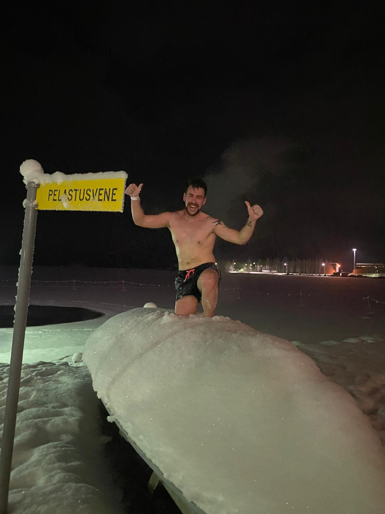
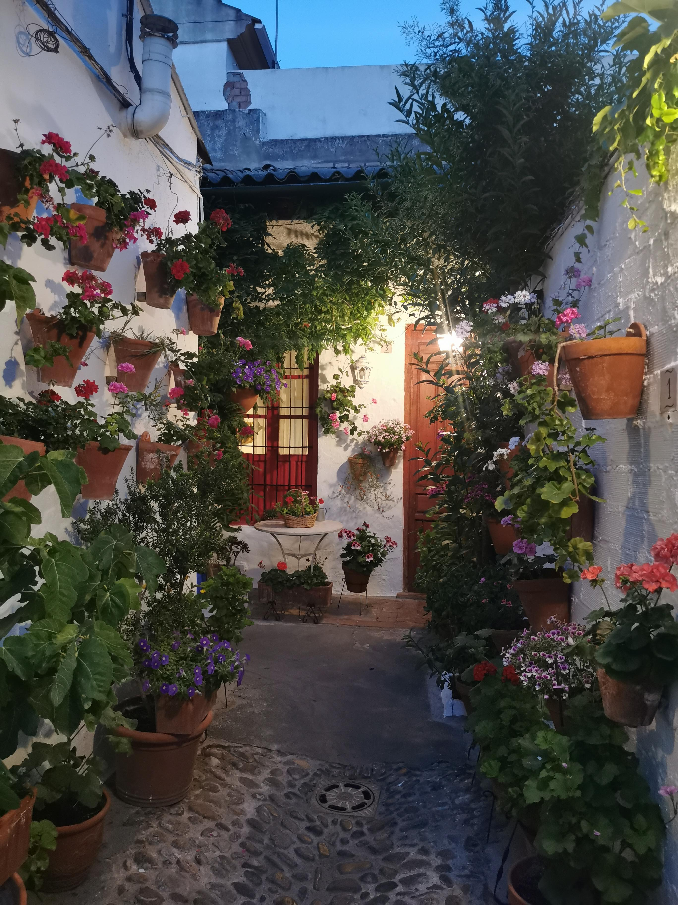
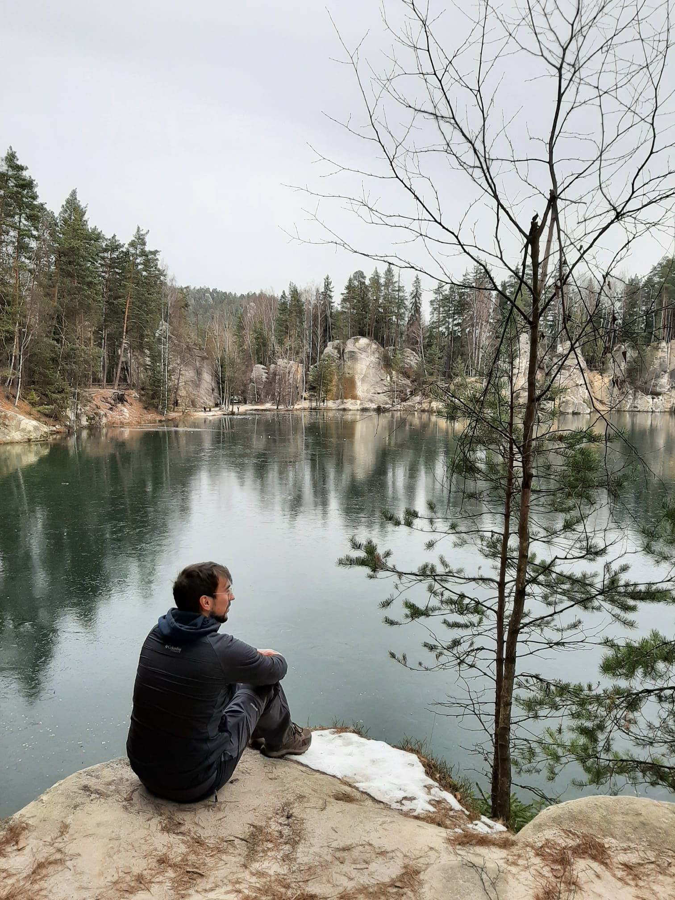
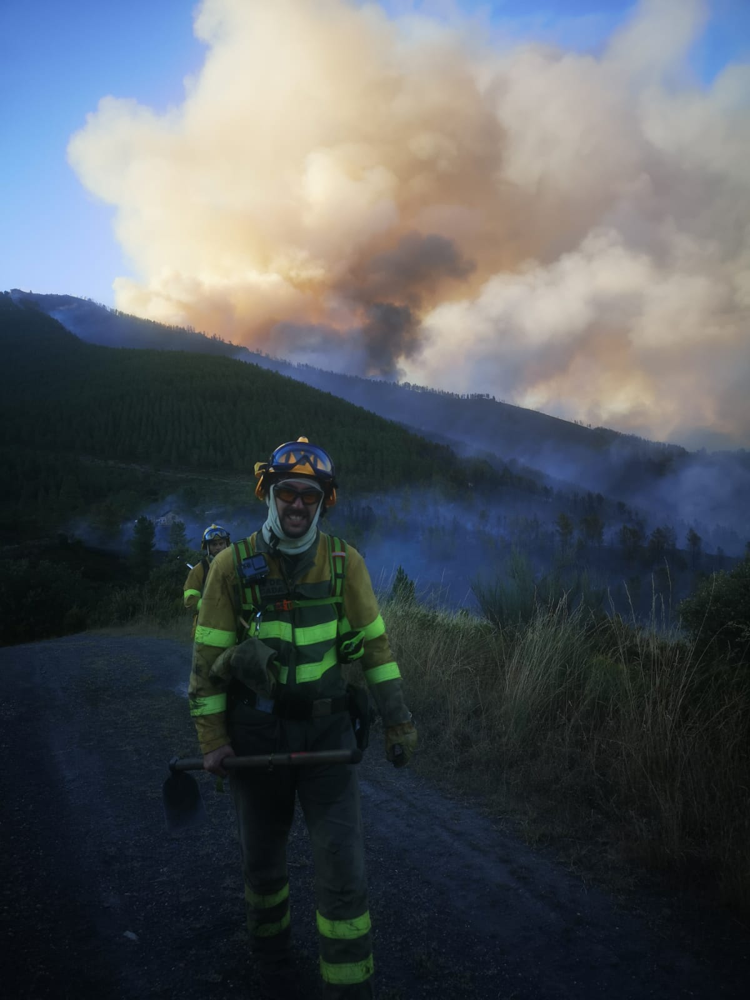
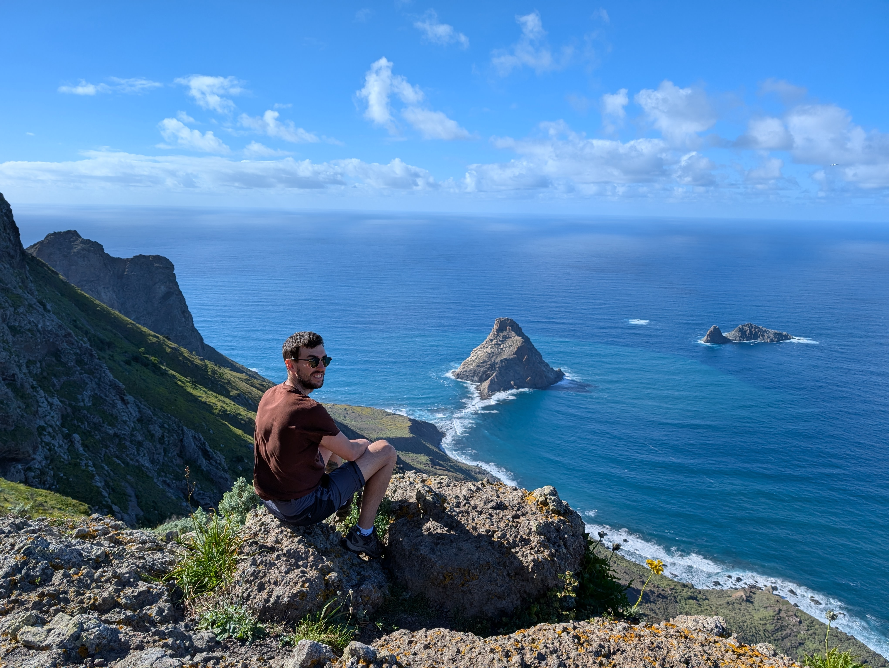

::: {#hero-heading}
:::

## Background

Hei! I am Adrián Cidre, a passionate Forestry Engineer with a Master's degree in Geomatics, Remote Sensing, and Spatial Models Applied to Forest Management, from the University of Santiago de Compostela and University of Córdoba respectively.

My passions are cycling, hiking, and traveling. I love to explore new places, cultures, and gastronomy, so I try to always look for new adventures 🚵🏖️.

During my career, I had the opportunity to learn and work in a wide range of environments. I started my forest career in 2016 studying a two-year forestry course in Mondoñedo (Galicia, Spain). After that, I started working in a company mostly helping with forest inventory.

:::::: columns
::: {.column width="45%"}
Just after these studies, I started my first summer season as firefighter in 2018👨‍🚒. I loved that job, and I wanted to continue working as a firefighter for more seasons. However, because of the precariousness of this job (and because my friend convinced me), I enrolled in Forestry Engineering at the University of Santiago de Compostela. During the four years of the bachelor (yes, in Spain the bachelors last 4 years), I learned from many different professionals of the forest sector. But my best decision came the third year when I decided to go to Joensuu (Finland) for an Erasmus experience. The six months I stayed in Finland changed me a lot, I think in the good way. I knew people from almost every country of Europe, and every region of Spain. It was a very enriching experience❄️.
:::

::: {.column width="5%"}
:::

::: {.column width="50%"}
{fig-align="center" width="300"}
:::
::::::

:::::: columns
::: {.column width="55%"}
{fig-align="center" width="300"}
:::

::: {.column width="5%"}
:::

::: {.column width="40%"}
The fourth year of my forestry engineering studies, I took another decision that opened me a lot of doors. The first semester I went as an exchange student to the University of Córdoba where I defended my bachelor thesis. A very warm but scenic city☀️🥀.

In my bachelor thesis I studied framentation and connectivity patterns associated to *Cerambyx* spp. in Sierra Morena (Spain) using a graph theory approach. The bachelor thesis was published afterwards in [forests](https://www.mdpi.com/1999-4907/15/4/648){target="_blank"}.
:::
::::::

:::::: columns
::: {.column width="35%"}
The next semester, I went to the Mendel University of Brno (Czech Republic) to do an Erasmus+ internship with a company associated with the university. I helped with forest inventory and nursery tasks during 3-4 months, and I explored most of the country.
:::

::: {.column width="5%"}
:::

::: {.column width="60%"}
{fig-align="center" width="300"}
:::
::::::

:::::: columns
::: {.column width="50%"}
{fig-align="center" width="300"}
:::

::: {.column width="5%"}
:::

::: {.column width="45%"}
Then we get to the summer of 2022, my last summer as firefighter🔥. In total I served as firefighter during 5 summer seasons. This experience allowed me to develop a deep understanding of wildfires and their impact on forests. I learned how to manage and prevent wildfires, as well as how to analyse their effects on the environment. Being part of a crew teaches you the importance of teamwork, leadership, and decision-making under pressure. These skills have been invaluable in my professional life.
:::
::::::

In September 2022 I started to study the Master in Geomatics, Remote Sensing, and Spatial Models applied to Forest Management at the University of Córdoba. My previous stay in Córdoba brought me there with a job offer in the LIFE FAGESOS project, in which I was working for about 1.5 years. This project (still running) focuses on finding solutions to the decay of dehesas and other forest systems because of *Phytopthora* species, specially *P. cinnamomi* which provokes the oak decline and the chestnut ink. My contribution to the project was developing models to project the distribution of this species in Mediterranean countries, and that was in the end my awarded master thesis and an article that is now published. The master thesis received an award and it was published in [Helvia](https://helvia.uco.es/handle/10396/33245){target="_blank"}, and also as a scientific article in [Ecological Modelling](https://www.sciencedirect.com/science/article/pii/S0304380025001012){target="_blank"}.

:::::: columns
::: {.column width="30%"}
When I finished the Master, I asked for an Erasmus+ internship at the Norwegian University of Life Sciences in Ås. I stayed in Norway four months, and it was another enriching experience with a lot of snow, lakes, and northern lights!
:::

::: {.column width="5%"}
:::

::: {.column width="65%"}
{fig-align="center" width="400"}
:::
::::::

:::::: columns
::: {.column width="45%"}
{fig-align="center" width="398"}
:::

::: {.column width="5%"}
:::

::: {.column width="50%"}
Finally, in 2025 I started working in a project of adaptive silviculture of the Canary pine in Tenerife🏝️. I lived in Tenerife for some months, and I developed some models to describe forest types in the island. I also worked creating a system of permanent plots continuing a work that started in 1989 to assess the dynamics, and performance of different thinning schemes, both for production and wildfire resistance. For different circumstances I had to leave the job in August 2025, and that's a quick description of my life since my first steps in the forest sector.
:::
::::::

## GIS specialist and R

My first experience with R was during my first year of university (2018), in a statistics course. However, it wasn't until my bachelor thesis in 2022 that I began to appreciate its potential. At first, it was frustrating—there were many moments when I wanted to give up. But persistence paid off: over time, I started delivering my work more efficiently and with better quality, learning new techniques along the way.

Today, I use R primarily for data analysis, data science, GIS, remote sensing, forest inventory, and much more. I've developed several R applications and courses aimed at supporting forest managers, researchers, and students. I'm passionate about teaching and sharing knowledge, and in my courses, I focus not only on how to use R effectively but also on helping others avoid the common mistakes I made when I was starting out.

Thank you for visiting, and I hope we can learn together! Just a quick note — I'm not an expert in any particular field, just a curious person who enjoys sharing what I learn along the way!

## Curriculum Vitae

My CV was created using the `{vitae}` R package, and you can find with the source code in [this repository](https://github.com/Cidree/Curriculum_ACG).
